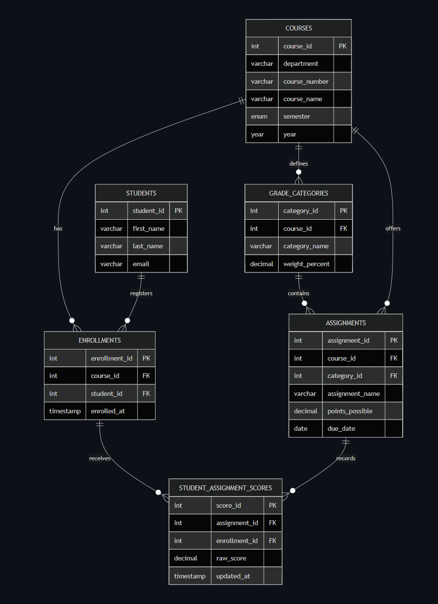

# Grade Book ER Diagram

## Mermaid ERD

<!-- 
```mermaid
erDiagram
    COURSES {
        int course_id PK
        varchar department
        varchar course_number
        varchar course_name
        enum semester
        year year
    }

    STUDENTS {
        int student_id PK
        varchar first_name
        varchar last_name
        varchar email
    }

    ENROLLMENTS {
        int enrollment_id PK
        int course_id FK
        int student_id FK
        timestamp enrolled_at
    }

    GRADE_CATEGORIES {
        int category_id PK
        int course_id FK
        varchar category_name
        decimal weight_percent
    }

    ASSIGNMENTS {
        int assignment_id PK
        int course_id FK
        int category_id FK
        varchar assignment_name
        decimal points_possible
        date due_date
    }

    STUDENT_ASSIGNMENT_SCORES {
        int score_id PK
        int assignment_id FK
        int enrollment_id FK
        decimal raw_score
        timestamp updated_at
    }

    COURSES ||--o{ ENROLLMENTS : has
    STUDENTS ||--o{ ENROLLMENTS : registers
    COURSES ||--o{ GRADE_CATEGORIES : defines
    GRADE_CATEGORIES ||--o{ ASSIGNMENTS : contains
    COURSES ||--o{ ASSIGNMENTS : offers
    ENROLLMENTS ||--o{ STUDENT_ASSIGNMENT_SCORES : receives
    ASSIGNMENTS ||--o{ STUDENT_ASSIGNMENT_SCORES : records
``` -->

## Keys and Constraints

- Primary keys:
  - courses.course_id
  - students.student_id
  - enrollments.enrollment_id
  - grade_categories.category_id
  - assignments.assignment_id
  - student_assignment_scores.score_id
- Foreign keys:
  - enrollments.course_id -> courses.course_id
  - enrollments.student_id -> students.student_id
  - grade_categories.course_id -> courses.course_id
  - assignments.course_id -> courses.course_id
  - assignments.category_id -> grade_categories.category_id
  - student_assignment_scores.assignment_id -> assignments.assignment_id
  - student_assignment_scores.enrollment_id -> enrollments.enrollment_id
- Composite integrity:
  - assignments(category_id, course_id) references grade_categories(category_id, course_id)
  - this ensures assignment category belongs to the same course
- Uniqueness:
  - one enrollment per (course, student)
  - one category name per course
  - one assignment name per course
  - one score per (assignment, enrollment)
